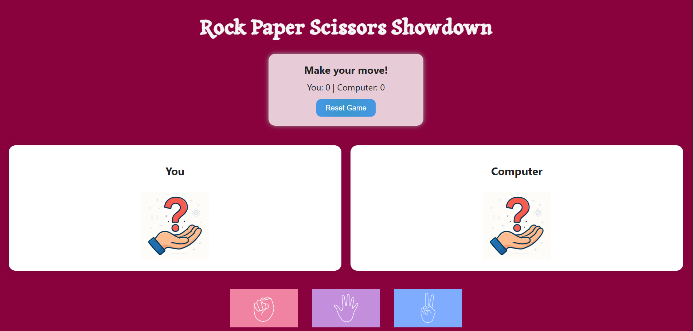

# Rock–Paper–Scissors Web Game 🕹️

A simple and interactive **Rock–Paper–Scissors** game built using **HTML**, **CSS**, and **JavaScript**.  
Challenge the computer, track your score, and enjoy smooth animations and cartoon-style graphics.



---

## 🎮 How to Play

- Click on **Rock**, **Paper**, or **Scissors**.
- The computer makes a random choice.
- The result ("You Win!", "You Lose!", or "Draw") is displayed along with the score.
- Hit **Reset** to start over!

---

## ✨ Features

- ✅ Clean UI with cartoon-style icons  
- ✅ Real-time result display  
- ✅ Score tracking  
- ✅ Reset button  
- ✅ Animated transitions  
- ✅ Custom hand images for user and computer choices

---

## 🛠️ Technologies Used

- **HTML5** — Structure  
- **CSS3** — Styling and layout  
- **JavaScript** — Game logic and interactivity  
- **DOM Manipulation** — Dynamic updates  
- **Event Handling** — Button clicks & game flow  

---

## 🚀 Getting Started

To run this project locally:

1. **Clone this repository:**
   ```bash
   git clone https://github.com/your-username/rock-paper-scissors.git
2. **Navigate into the folder**
   ```bash
   cd rock-paper-scissors
3. Open ```index.html``` in your browser.

---

## 🌐 Live Demo Website


👉 [Click here to play the game!]()
